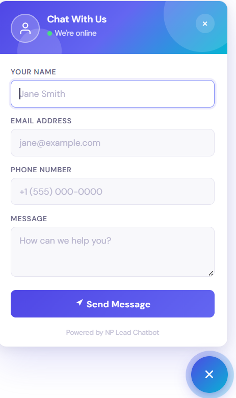
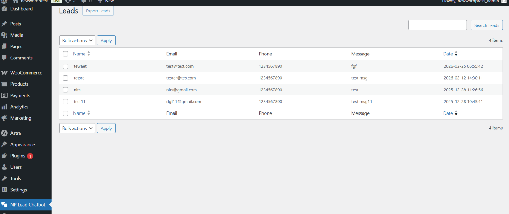
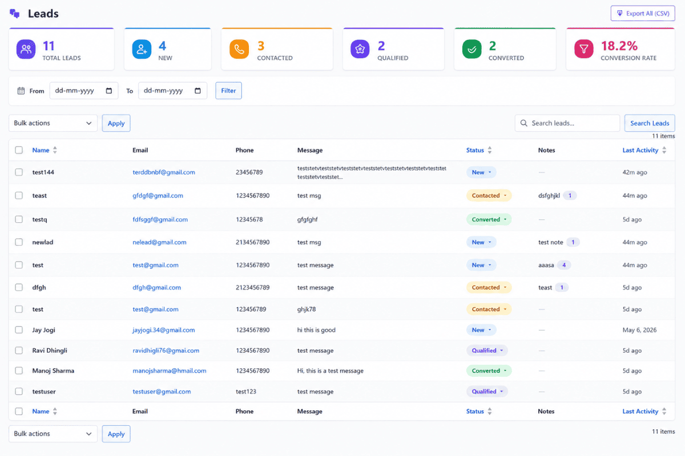
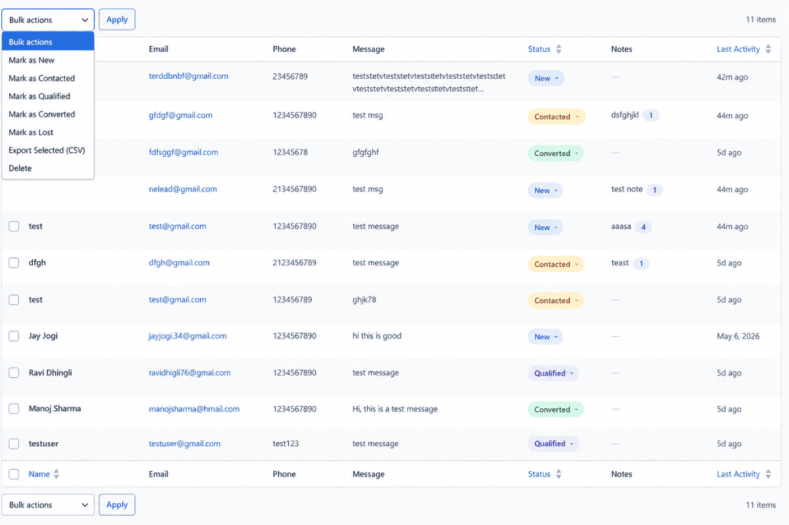
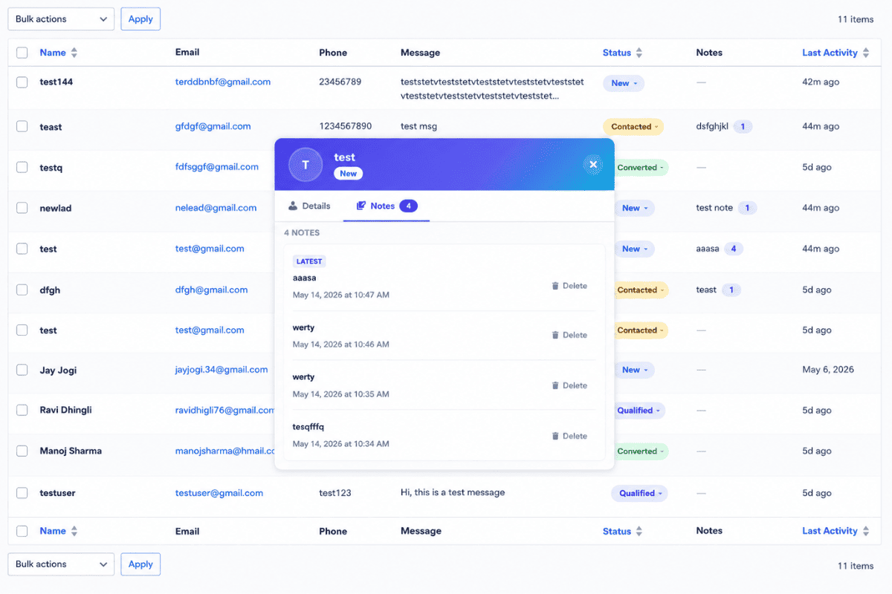
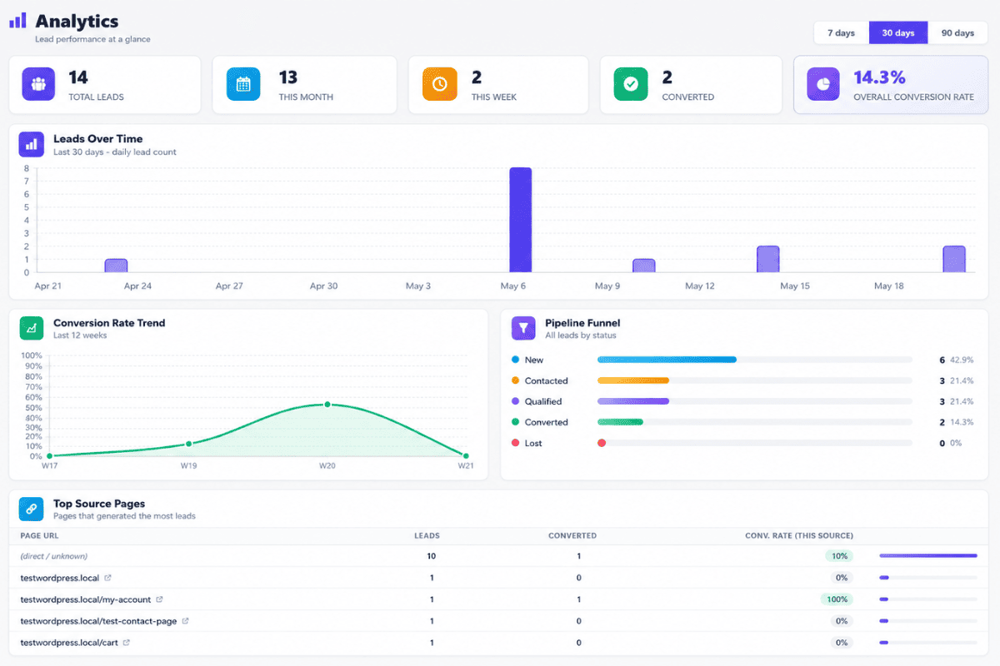
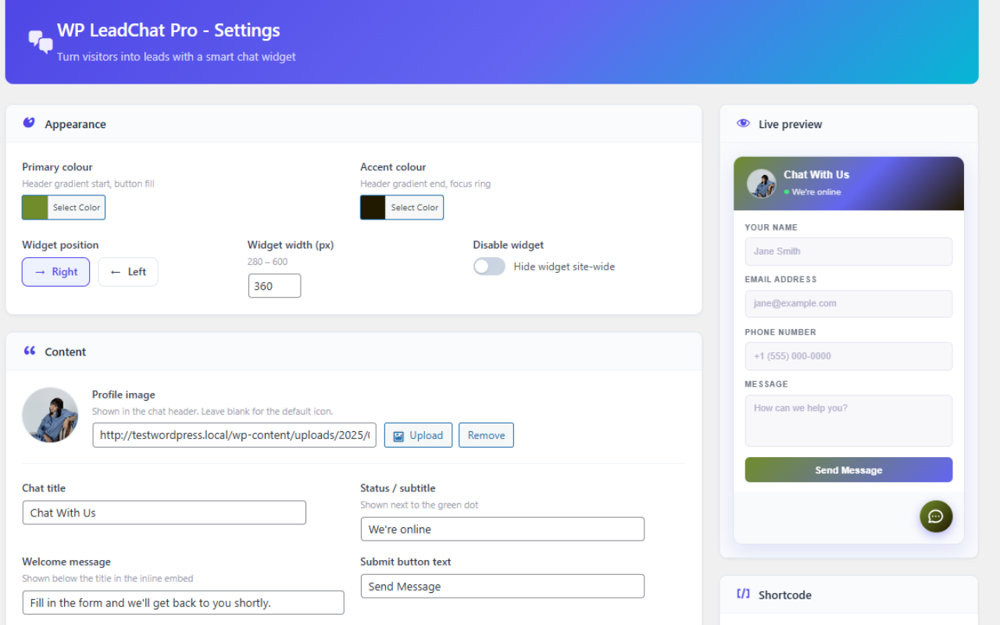
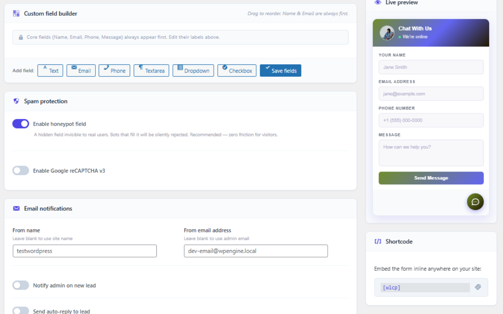

# Lead Capture Chat


A modern floating lead capture chat widget for WordPress. Collect visitor leads directly on your site and manage everything inside your WordPress dashboard - no SaaS, no monthly dependency, no data leaving your server.

---

## 🌐 Links

| | |
|---|---|
| 🌐 Live Demo & PRO Preview | https://leadcapturechat.netlify.app/ |
| 🎥 Watch the PRO Demo | https://go.screenpal.com/watch/cOhYQKntkfx |
| 🚀 Upgrade to PRO | https://checkout.freemius.com/plugin/29207/plan/48049/ |
| 🔌 WordPress.org Plugin Page | https://wordpress.org/plugins/wp-lead-chatbot/ |

---

## ✅ Free Features

- Floating animated lead capture widget
- Inline shortcode - `[npleadchat]`
- Leads dashboard with search, sorting, and bulk delete
- CSV export
- Client-side validation
- REST API powered with nonce verification
- GDPR-friendly local storage
- Locally bundled fonts (no Google Fonts request)
- Works with Elementor, Divi, Gutenberg, and WooCommerce

---

## 🚀 PRO Features

### Lead Capture
- Unlimited leads - no cap
- Custom Field Builder (Text, Email, Phone, Dropdown, Checkbox, Textarea)
- Drag-and-drop field reordering
- Live admin preview

### Email Automation
- Admin notification emails
- Visitor auto-replies
- Template tag support
- Custom sender identity

### Spam Protection
- Honeypot field
- Google reCAPTCHA v3

### Appearance & Branding
- Full colour picker controls
- Widget position (left / right)
- Adjustable widget width
- Custom logo / profile image upload
- Editable welcome text and branding

### CRM Dashboard
- 5-stage lead pipeline management
- Inline status updates with AJAX
- Live KPI stats & conversion tracking
- Status filter tabs with lead counts
- Quick notes & full activity log
- Bulk status updates & CSV export
- Date range filters & last activity tracking
- Toast notifications & keyboard navigation

### Analytics Dashboard
- Interactive leads & conversion charts
- Pipeline funnel visualisation
- Top source pages tracking
- Live KPI summary dashboard
- AJAX-powered date range filtering
- Real-time analytics from your own database
- No external tracking or third-party services

> Plans start at $3/month · 14-day free trial · 30-day money-back guarantee

---

## Free vs PRO

| Feature | Free | PRO |
|---|:---:|:---:|
| Floating Chat Widget | ✅ | ✅ |
| Inline Shortcode | ✅ | ✅ |
| CSV Export | ✅ | ✅ |
| Unlimited Leads | ❌ | ✅ |
| Custom Fields | ❌ | ✅ |
| Email Notifications | ❌ | ✅ |
| Auto Replies | ❌ | ✅ |
| Spam Protection | ❌ | ✅ |
| Appearance Control | Basic | Full |
| Live Admin Preview | ❌ | ✅ |
| CRM Dashboard | ❌ | ✅ |
| Analytics Dashboard | ❌ | ✅ |
| Priority Support | ❌ | ✅ |

---

## Installation

**From WordPress.org (recommended)**

1. Go to **Plugins → Add New**
2. Search for **Lead Capture Chat**
3. Click **Install Now**, then **Activate**

**Manual**

```bash
# Download the ZIP from WordPress.org, then:
# WP Admin → Plugins → Add New → Upload Plugin → Activate
```

After activation the floating widget appears automatically. Visit **WP Admin → NP Lead Chatbot** to manage leads.

---

## Shortcode

```php
[npleadchat]
```

Embeds the lead form inline anywhere - pages, posts, or widget areas.

---

## 📸 Screenshots

### Floating chat widget



### Leads Dashboard



### PRO: Leads dashboard (CRM)



### PRO: Status dropdown



### PRO: Lead detail modal - Notes tab



### PRO: Analytics dashboard



### PRO: Settings + live preview



### PRO: Custom Field Builder + Spam Protection + Email notifications



---

## Changelog

### 2.3.1 
- Add new screenshots of PRO Plugin
- Make some content changes in the admin Upgrade to PRO page
- Minor bug fixes and styling improvements

### 2.3.0
- **Added** in-admin **Upgrade to PRO** page (`WP Admin → NP Lead Chatbot → Upgrade to PRO 🚀`) with full feature list, Free vs PRO comparison table, and live preview / checkout links
- **Added** dismissible admin notice promoting PRO - permanently dismissible per-user via a nonce-protected link, no JavaScript dependency
- **Improved** all upsell code is fully i18n-ready, properly escaped, and follows WordPress coding standards
- **Improved** upsell is automatically disabled when the PRO version is active - no duplicate notices or menus
- Version bumped to **2.3.0**

### 2.2.3
- Improved upgrade CTAs
- Added comparison table
- Enhanced PRO promotion in readme

### 2.2.2
- Added demo video link
- Minor readme content changes

### 2.2.0
- Added Pro upsell section in plugin description
- New FAQ entries for Pro features

### 2.0.0
- Complete UI redesign - gradient header, DM Sans font, animated popup
- Locally bundled fonts (removed Google Fonts dependency)
- Added ARIA labels and accessibility improvements
- Added `[npleadchat]` inline shortcode

### 1.2.0
- Added CSV export

### 1.0.0
- Initial release

---

## Privacy

All lead data is stored inside your own WordPress database. The plugin makes no external API requests. No tracking, no SaaS dependency, no third-party storage.

---

## Contributing

Issues and pull requests are welcome via the [GitHub repository](https://github.com/NiteshPatel-1988).

---

## License

GPL v2 or later - https://www.gnu.org/licenses/gpl-2.0.html
